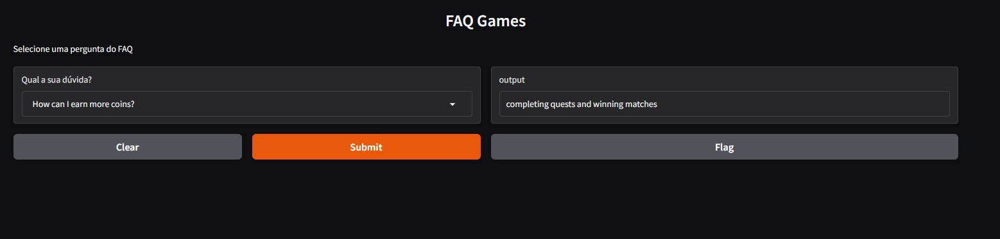

# 🎮 FAQ Games AI

Aplicação simples de FAQ inteligente para Games utilizando Inteligência Artificial com Hugging Face Transformers e interface web criada com Gradio.

O projeto utiliza o modelo `deepset/roberta-base-squad2` para responder perguntas baseadas em um dataset de FAQs sobre jogos.

---

# 🚀 Tecnologias Utilizadas

- Python
- Pandas
- Hugging Face Transformers
- RoBERTa SQuAD2
- Gradio
- NLP (Natural Language Processing)

---

# 🧠 Como Funciona

A aplicação:

1. Carrega um dataset CSV contendo perguntas e respostas
2. Recebe uma pergunta do usuário
3. Busca o contexto correspondente no dataset
4. Utiliza um modelo de Question Answering para extrair a resposta
5. Exibe a resposta em uma interface web interativa

---

# 📂 Estrutura do Projeto

```bash
FAQAi/
│
├── dados/
│   └── games_faq.csv
│
├── app.py
├── requirements.txt
└── README.md
```

---

# 📊 Dataset

O dataset contém perguntas frequentes sobre Games.

Exemplo:

| Question | Answer |
|---|---|
| How do I unlock a new character? | You can unlock new characters by opening reward boxes. |
| Why is my game crashing? | Update the game to the latest version and restart your device. |

---

# ⚙️ Instalação

Clone o repositório:

```bash
git clone https://github.com/rafaelraah/FAQAi
```

Entre na pasta:

```bash
cd FAQAi
```

Crie o ambiente virtual:

```bash
py -3.11 -m venv .venv
```

Ative o ambiente virtual:

## Windows

```bash
.venv\Scripts\activate
```

## Linux / Mac

```bash
source .venv/bin/activate
```

Instale as dependências:

```bash
pip install -r requirements.txt
```

---

# ▶️ Executando o Projeto

```bash
python app.py
```

---

# 💡 Exemplo de Uso

Pergunta:

```text
How can I improve my rank?
```

Resposta:

```text
Win ranked matches consistently and avoid leaving games early.
```

---

# 🖥️ Interface Web

A interface foi desenvolvida utilizando Gradio.

O usuário pode:

- Selecionar perguntas em um dropdown
- Receber respostas automaticamente
- Testar o modelo localmente no navegador

---

# Screenshot



---

# 🧠 Modelo Utilizado

Modelo utilizado:

`deepset/roberta-base-squad2`

Baseado em:

- RoBERTa
- SQuAD2
- Question Answering

---

# 📦 Dependências Principais

```txt
transformers
torch
pandas
gradio
```

---

# 🎯 Objetivo do Projeto

Este projeto foi criado para estudos sobre:

- NLP
- Hugging Face
- Question Answering
- Inteligência Artificial aplicada
- FAQ inteligente
- Interfaces web para IA

---

# 📄 Deploy Hugging Face Spaces
 - https://huggingface.co/spaces/rafaelrdn/FAQAi

---

# 📄 Licença

Projeto desenvolvido para fins de estudo e aprendizado.